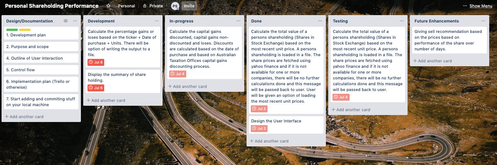

# Personal Share Holding Performance

**Statement of Purpose and Scope**

The project was set up to implement a share holding calculation terminal/Command-Line application that will calculate the total value of the share holding and important information about the share holding i.e. Capital Gains, Discounted Capital gains and loses. 

**Description** 

Personal Share Holding Performance is a tool that can summarise the value of share portfolio
for a single user. It will provide a report that lists all the shares, units, cost base (purchase price including the brokerage charges), latest unit price of each share, total value of the units, discounted and non-discounted capital gain for taxation purpose, losses and percentage gains or loses to help with further investigation and decision to sell or hold. 

There is also a summary provided, which helps with a quick view. Quick views can indication where there is urgent attention required to manage loses. This is important for people who are using margin loans to invest in share market. Margin loan and Margin call details can be added as an enhancement. 

This application only supports share holding in Australian Stock Exchange.

**Problems it will solve**

Most of the platforms in the market provide the shares held by the share holder but are very long to read and are not useful enough to have a quick look and decide if there is an action required to prevent loses or sell shares. The output provided by this application is simple enough to understand and take action. 

The user can also provide an input file with unit prices. This is helpful if the user wishes to understand the best price to help with Capital gains or tax minimisation with Capital gains. Taxation calculation are helpful for active users who are active toward the end of the financial year. Future enhancement will include more on taxation. 

**Target Audience**

The Personal Share Holding Performance application is helpful for anyone who has invested in the Australian Stock Exchange and prefer to manage it without spending too much time.

**How to use the application**

The user should provide a file input with all the shares that user holds. The csv(comma
separated file) file should contain the following data in the format below.

TICKER,Date of Purchase,Units,Cost Base
ALQ,13/12/2008,10,190.71
ALU,14/12/2008,10,377
ALX,15/12/2008,10,88.87

If the user wishes to calculate the total value of share holding based on a price, then a
price file should be provided in the following format. 

TICKER,Date,Unit Price
ALQ,1/07/2019,19.071
ALU,1/07/2019,37.7
ALX,1/07/2019,8.887

All the file should be in the current folder and should have permissions to read.

If the user wishes to write the output to a file, then the output filename should be provided.

The arguments should be passed in the following format. The output file is written to current
directory and permission to write file is required.

`python3 personal_sharehold_performance.py -i Capitalgains.csv -p Shareprice.csv -o output.csv`

If no price file is provided, the price will be retrieved using yahoo finance. This can only
work for ASX shares.

The summary of output will have the following details.
****** Summary of Share Holding - These are unrealised values ******
Total Cost Base of Share Holding : 1617.21
Total Value of Share Holding : 2100.4
Total Units of Share Holding : 150.0
Total Capital Gain that is not Discounted : 1164.59
Total Capital Gain that is Discounted : 582.295
Total Capital Losses : -681.4

**Glossary**

Capital Gains and Losses - To learn more about Capital gains and loses, please visit the Australian Taxation Office website. Capital gains are discounted if the unit of share is held for more than a year. Capital loses from the past financial years are applied before discounting. Loses can be carried forward.  https://www.ato.gov.au/General/Capital-gains-tax/

Margin Lending - Margin loans are loans that are borrowed to invest and amount of loan that can be borrowed is based on the value of the share holding. If the value of share holding decreases, there is a risk of Margin call. https://www.moneysmart.gov.au/investing/borrowing-to-invest/margin-loans

**Features**

The three main features of the application are :

1. Calculate the total value of a persons shareholding (Shares in Stock Exchange) based on the most recent unit price. A persons shareholding is loaded in a file. The share prices are fetched using yahoo finance and if it is not available for one or more companies, there will be no further calculations done and this message will be passed back to user. User will be given an option of loading the most recent unit prices.  The share porfolio is stored in an Ordered Dictionary to maintain the order of the rows and columns. Yahoo finance needs .AX at the end of share code, so the string were appended with .AX.  A custom exception ShareCalculationException is raised if there is an issue with data.
2. Calculate the capital gains discounted, capital gains non-discounted and loses. Discounts are calculated based on the date of purchase and based on Australian Taxation Offices capital gains discounting process. For loops was used to go through each row in the csv file. There were variables used to calculate each of the values, like the total value, total gains and loses. Variables are declared outside the loop. Number of days between now and the date of purchase was used to calculate the discounted capital gains. If the shares were held for more than 365 days, a 50% discount was applied on the total gain. This is calculated for each row.
3. Calculate the percentage gains or loses based on the ticker. This was done by calculating the increase or decrease in value compared to the purchase price. All the loses, loss percentage and the sum of all loses have a negative sign. There is an option of writing the output to a file. Python csv package was used to write the ordered dictionary into the file. The data is comma separated. The output can be pasted into an excel sheet and all the rows and columns will be displayed correctly. There is sum of the columns displayed on the last row. Simple formating was done to implement totals on the last line. 

**User Interaction and Experience**

Please refer to 'How to use the application' section above for details. 

The following screenshot displays output of the application when yahoo finance is used to do the calculation. The summary has Capital loss highlighted in Red. The user can go to comma separated data and look at the losses and loss percentage to further investigate and make decision to sell. If the loss or percentage loss is high, it needs urgent attention. If the user has margin loan, then the total value of share holding in green helps to understand the risk. 

The following screen shot uses Shareprice in a file instead of getting it from yahoo finance. User has to provide the Shareprice. 

In the following screen shot, there is a data error with one of the rows highlighted in blue. The application does not proceed with calculation as the results would be incomplete and an error message is displayed on screen. 

**Control Flow Diagram**

**Implementation Plan**

The cross on the date indicates the deadline for the task. Some of the tasks span for two days. The tasks on a day should be completed before moving to next task. Tasks have dependencies. 

| Implementation   Plan | Features                                                     | Sub tasks                                                    | 2/7/19 | 3/7/19 | 4/7/19 | 5/7/19 | 6/7/19 |
| --------------------- | ------------------------------------------------------------ | ------------------------------------------------------------ | ------ | ------ | ------ | ------ | ------ |
|                       | Total   Value of Persons Share Holding                       | Understand   the requirement and tests for all features.     | X      |        |        |        |        |
|                       |                                                              | Identify   all the data structures required across all features. | X      |        |        |        |        |
|                       |                                                              | Identify   the common modules/functions for validation and common tasks. Write psedo   code and methods(All ) | X      |        |        |        |        |
|                       |                                                              | Identify   all the test case and write the test cases based on the methods from previous   step |        | X      |        |        |        |
|                       |                                                              | Complete   the common Modules, Validation of Data, Reading and writing files, Handling   exceptions, Calling external interface, Arguments processing. |        | X      |        |        |        |
|                       | Summary   of the Share Holding, Discounted and non Discounted Capital gains, loses | Implement   unit price retrival, calculate total value       |        | X      |        |        |        |
|                       |                                                              | Calculate   Capital Gains                                    |        |        | X      |        |        |
|                       |                                                              | Calculate   Capital Loses                                    |        |        | X      |        |        |
|                       |                                                              | Calculate   Discount                                         |        |        | X      |        |        |
|                       |                                                              | Run   Unit test and fix control flow issues                  |        |        | X      |        |        |
|                       | Percentage   gains or losses                                 | Modify   function to include percentage gain, losses         |        |        | X      |        |        |
|                       |                                                              | Calculate   sum totals for summary                           |        |        |        | X      |        |
|                       |                                                              | Execute   Pytest, Modify code, fix errors                    |        |        |        | X      | X      |
|                       |                                                              | Pylint   code, modify Code                                   |        |        |        | X      | X      |
|                       |                                                              | Execute   Pytest, Modify code, fix errors                    |        |        |        | X      | X      |

**Project Management**

